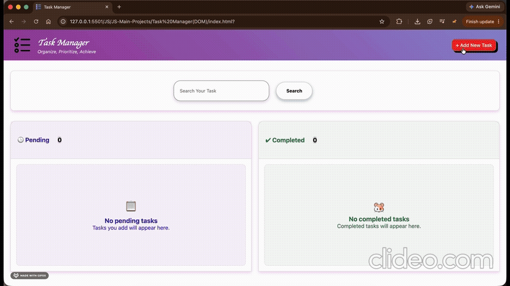
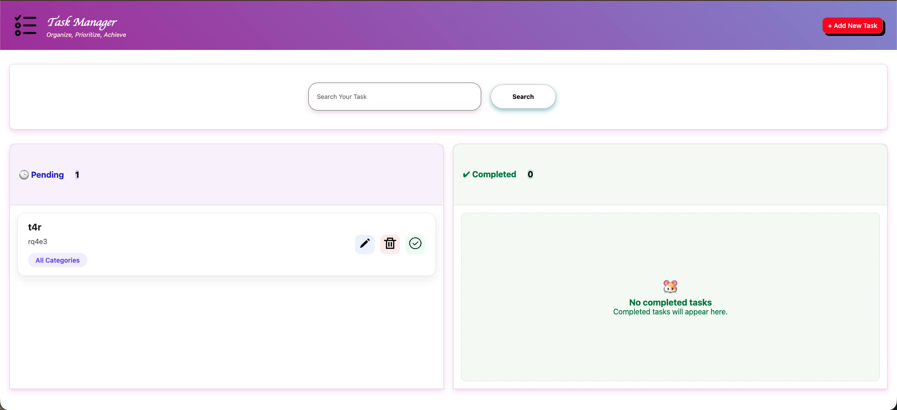
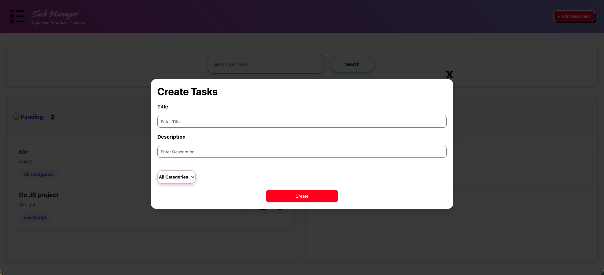
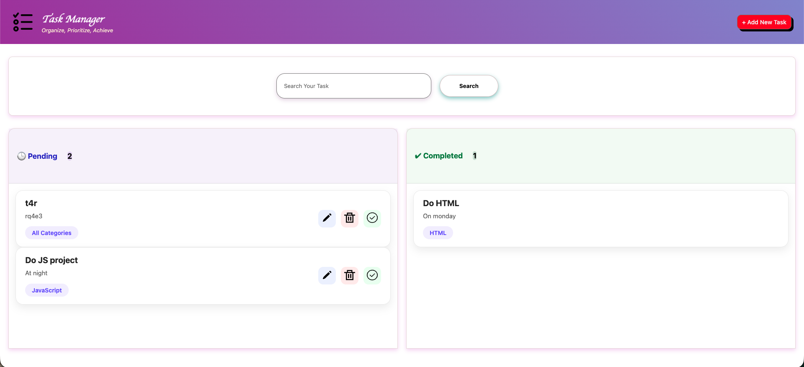

# 🚀 Task Manager

> **A modern Task Management Web Application built entirely with HTML, CSS, and Vanilla JavaScript.**

This project is a fully functional task manager that allows users to create, update, delete, search, and complete tasks with persistent browser storage using the Local Storage API.

The primary goal of this project was to strengthen my understanding of JavaScript fundamentals by building a real-world application from scratch using only core web technologies.

---
<a href="https://shiv995545.github.io/Task-Manager/">Check the Live Project</a>

## 🎥 Demo




---

## 📸 Screenshots

### 🏠 Home


### ➕ Create Task


### ✅ Completed Tasks


---

## ✨ Features

- ✅ Create new tasks
- ✏️ Edit existing tasks
- 🗑️ Delete tasks
- ✔️ Mark tasks as completed
- 🔍 Search tasks by title, description, or category
- 💾 Persistent data using Local Storage
- 📊 Live Pending & Completed task counters
- 🏷️ Category-based task organization
- 🎨 Interactive and responsive user interface
- ⚡ Dynamic DOM manipulation without page reloads

---

## 🛠️ Built With

- HTML5
- CSS3
- Vanilla JavaScript (ES6)
- Local Storage API

> No frameworks or external JavaScript libraries were used.

---

## 📂 Project Structure

```
Task Manager(DOM)
│
├── images/
│   ├── logo.png
│   ├── edit.svg
│   ├── delete.svg
│   ├── complete.svg
│   ├── home.png
│   ├── create-task.png
│   ├── completed.png
│   └── demo.gif (optional)
│
├── index.html
├── style.css
├── script.js
└── README.md
```

---

## ⚙️ How It Works

### ➕ Create Tasks
Create new tasks by providing:
- Title
- Description
- Category

### ✏️ Update Tasks
Modify existing task details whenever required.

### 🗑️ Delete Tasks
Remove tasks permanently from the pending list.

### ✅ Complete Tasks
Move finished tasks to the Completed section with a single click.

### 🔍 Search Tasks
Instantly search through pending tasks using:
- Task Title
- Description
- Category

### 💾 Persistent Storage
All tasks are saved using the browser's **Local Storage**, allowing data to remain available even after refreshing or reopening the browser.

---

## 📚 Concepts Practiced

Building this project helped me improve my understanding of:

- DOM Manipulation
- Event Handling
- CRUD Operations
- JavaScript Arrays & Objects
- Dynamic Rendering
- Form Validation
- Local Storage API
- Search & Filtering
- State Management
- Responsive UI Design
- UUID Generation using `crypto.randomUUID()`

---

## 📋 Feature Status

| Feature | Status |
|----------|:------:|
| Create Task | ✅ |
| Edit Task | ✅ |
| Delete Task | ✅ |
| Complete Task | ✅ |
| Search Tasks | ✅ |
| Local Storage | ✅ |
| Categories | ✅ |
| Responsive UI | ✅ |

---

## 🚀 Getting Started

### Clone the repository

```bash
git clone https://github.com/shiv995545/task-manager.git
```

### Open the project

Simply open `index.html` in your browser.

Or run it using **Live Server** in Visual Studio Code.

---

## 🔮 Future Improvements

- 🌙 Dark Mode
- 📅 Due Dates
- ⭐ Task Priorities
- 🗂️ Category Filters
- 🎯 Drag & Drop Task Sorting
- 📤 Export Tasks
- 🧹 Clear Completed Tasks
- ☁️ Backend Integration
- 🔔 Notifications & Reminders

---

## 💡 Why I Built This Project

Instead of relying on frameworks, I wanted to strengthen my understanding of the fundamentals by building a complete application using only HTML, CSS, and JavaScript.

This project challenged me to work with dynamic DOM updates, browser storage, application state, and user interactions while keeping the code organized and maintainable.

---

## 🤝 Feedback

Suggestions and constructive feedback are always appreciated.

If you discover a bug or have ideas for improvements, feel free to open an issue or submit a pull request.

---

## ⭐ Show Your Support

If you found this project useful or interesting, consider giving it a **⭐ Star** on GitHub.

---

## 👨‍💻 Author

SHIVAM GUPTA

GitHub: https://github.com/shiv995545

---

> **"The best way to learn JavaScript is to build real projects."**
